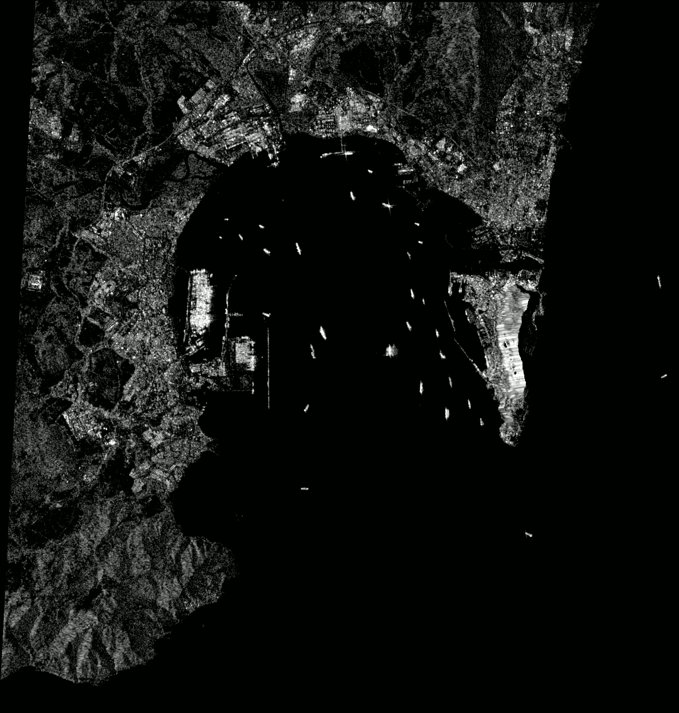
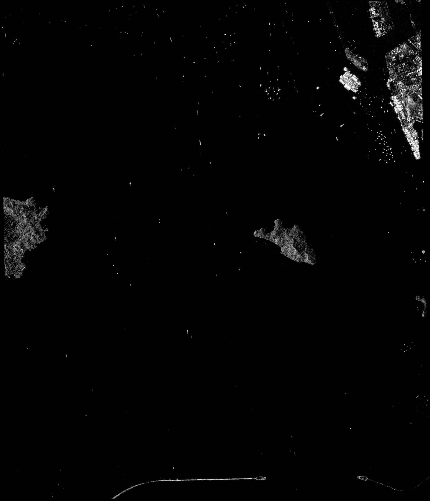
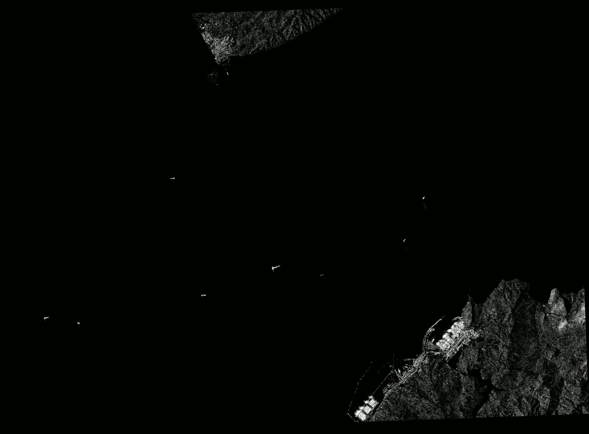

# vesselTracker
Project based on reduced model of Yolov5 architecture using Pytorch. Custom dataset based on SAR imagery provided by Sentinel-1 through Eart Engine API. In progress.

## Next updates

- Provide more information as output: Earth Engine API also provides coordinates of the scenes. Therefore, the Earth's surface in km2 analyzed by the algorithm can be calculated. With the positions of the vessels on the scenes, the position of each vessel could be also estimated in geographic coordinates. Export info to dataFrame using Pandas.
- Add vessel type detection: There are few datasets with vessel types classified. These can be included on the program developed on this project to not only detect vessels, but also classified them into classes (cargo, tanker, other type).

## Objectives

- [x] Program script that downloads images from Sentinel-1 through Earth Engine API
- [x] Select object detection model
- [x] Select and customize datasetS
- [x] Train model
- [x] Program detection script
- [ ] Add vessel classification
- [ ] Estimate vessel position in geographic coordinates 


## Example of input

  ```sh
  python get_images.py --location algeciras --start_date 2019-10-1 --end_date 2019-10-3
  python detect.py --dir_in Images/algeciras --dir_out Images/algeciras_detected
  ```

## Output of the model:

<p align = "center">

</p>
<p align = "center">
Fig.1 - Algeciras port scene with detected vessels. Photo taken on 2 October 2019
at 18:17h
</p>

<p align = "center">

</p>
<p align = "center">
Fig.2 - Shenzhen bay scene with detected vessels. Photo taken on 27 December 2019
at 10:33h
</p>

<p align = "center">

</p>
<p align = "center">
Fig.3 - Strait of Gibraltar scene with detected vessels. Photo taken on 28 February 2020 at 18:25h
</p>
