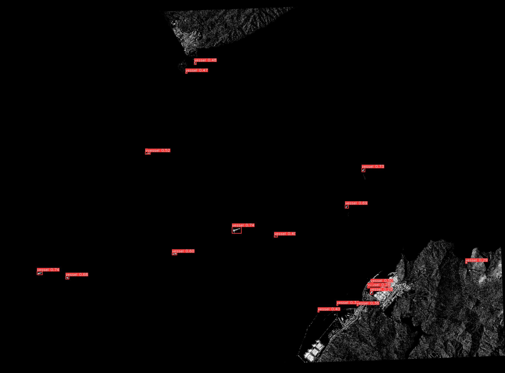
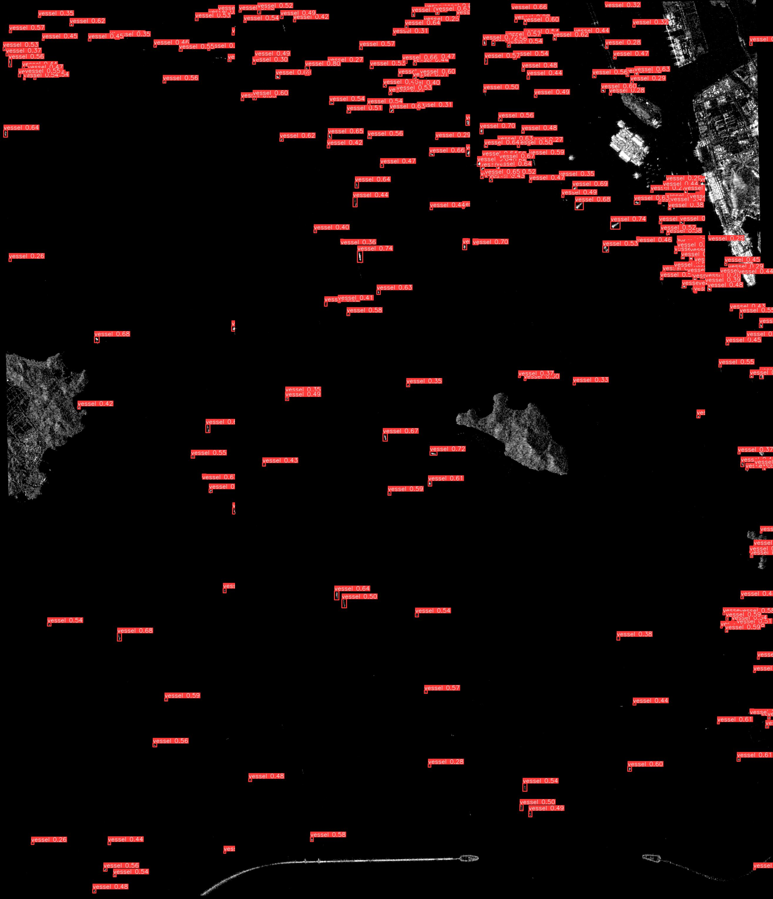
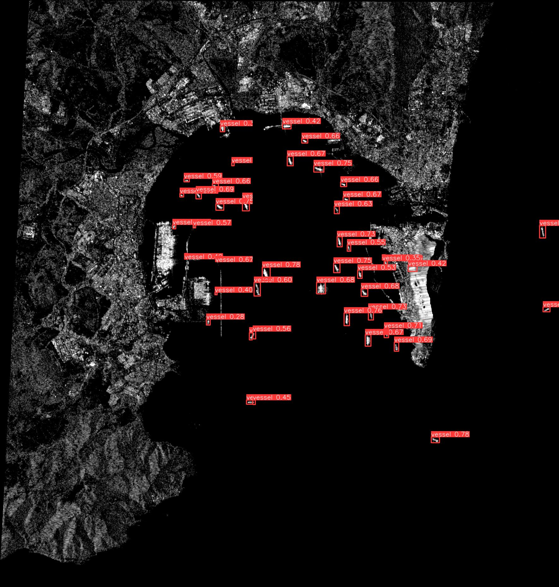

# vesselTracker
Project based on reduced model of Yolov5 architecture using Pytorch. Custom dataset based on SAR imagery provided by Sentinel-1 through Eart Engine API. In progress.

## Next updates

- Provide more information as output: Earth Engine API also provides coordinates of the scenes. Therefore, the Earth's surface in km2 analyzed by the algorithm can be calculated. With the positions of the vessels on the scenes, the position of each vessel could be also estimated in geographic coordinates. Export info in DataFrames using Pandas.
- Add vessel type detection: There are few datasets with vessel types classified. These can be included on the program developed on this project to not only detect vessels, but also classified them into classes (cargo, tanker, other type).

## Examples

Fig.1 - Strait of Gibraltar scene with detected vessels. Photo taken the 28th of February of
2020 at 18:25h

Fig.2 - Shenzhen bay scene with detected vessels. Photo taken the 27th of December of 2019
at 10:33h

Fig.3 - Algeciras port scene with detected vessels. Photo taken the 2nd of October of 2019
at 18:17h

